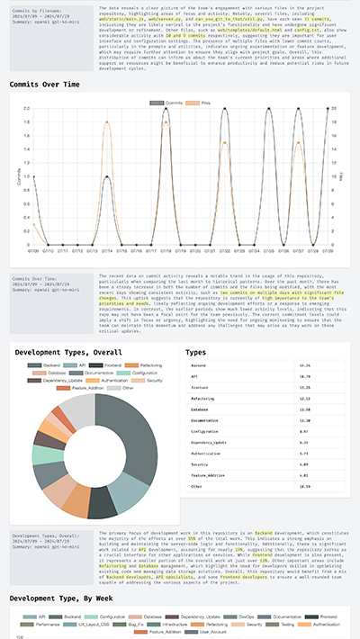

# Can You Git To That
## A visualization toolset to use AI to understand the history of a Repo


Did you ever get a new gig and have to understand a repo?  Maybe not just one repo, but maybe
six or __sixty__ repos?

Context is everything, and part of understanding a product, a team, or a codebase is getting the right
understanding of it's progression over time.  How did it get here?  How has it changed, and what were
the big inflection points?  How can I contribute to this project? Is it flourishing, or it is time to put this one out to pasture?

Lots of AI tools for code, at the moment, are focused on zero-to-one generation of boilerplate code.  _Can You 
Git To That_ (CYGTT) will organize, classify and visualize data about your Github repo so that you can gain valuable
context on the project's history, development processes, as well as the lifecycle of the code itself.

<A HREF="assets/screenshot_7_29_2024.png"></A>

The screenshot, above, is a representative view of the output from this project.  Click to see the full screenshot.

## How does it work?

First, copy/clone the repo to your local directory.  Currently tested under Python 3.11.  You can setup a venv, if you like; then run `pip install -r requirements.txt` to install necessary libraries.

To run it, modify the settings in the tab-delimited `config.txt`. This file, `example.py`, is a bare-bones example to show you the paths and includes needed to run the app. You can run it with `python3 example.py` within the root of your local copy of the repo.

What's gonna happen?  Well, first, the app reads `config.txt` and collects and generates a bunch of data about your repo.  To collect data, it uses <a href="https://github.com/PyGithub/PyGithub">PyGithub</a> to query the Github API (you'll need a Github personal access token, more info below), ultimately moving that data into a Sqlite database in the `output` directory.  To generate, the app uses an LLM (either OpenAI or Ollama, as configured in `config.txt`) to generate plain-language summaries (of commit diffs) and to classify and tag file changes, and store them in the database.

Once this process completes succesfully, the next step is to run `flask --app server run` from the `web` directory, which will serve reports from <a href="http://127.0.0.1:5000">http://127.0.0.1:5000</A>.


## Config Details

### Github Personal Access Token
You'll need to have a Github access token set up in your environment variables for CYGTT to work.  

To get an access token, in the upper-right corner of any page on GitHub, click your profile photo, then click `Settings` from the dropdown menu.  On the page that appears, in the left sidebar (look all the way at the bottom of the sidebar, it's easy to overlook), click `Developer settings`. In the next left sidebar, under `Personal access tokens`, you can use the "new fine-grained personal access token" to allow specific repos.  Select the following permissions:

 * Commit statuses: readonly
 * Contents: readonly
 * Pull Requests: readonly

Then set the token value on your system environment as `CYGTT_GITHUB_ACCESS_TOKEN`.

### Ollama setup

If you'd like to run this against a local open-source LLM, instead of using (and paying for) an API such as OpenAI,
you can use <A HREF="https://ollama.com/download">Ollama</A> quite effectively.  To optimize Ollama models for reading
larger codefiles you may need to extend the default context window from 2048 tokens to 8192 tokens or more.  Here's how to tweak Ollama for a larger context window, use your preferred, already installed, Ollama model name in place of `<model_name>` in the instructions below.

#### Step 1: Retrieve the Model Configuration
Export the model's current configuration:

```ollama show <model_name> --modelfile > model_conf.txt```

#### Step 2: Modify the Configuration File
Open `model_conf.txt` in a text editor and:

Add the line: ```PARAMETER num_ctx 8192```
To make sure updates keep the change, replace the line starting with `FROM` with: ```FROM <model_name>:latest```

Save and close the file.

#### Step 3: Create a New Model
Create a new model with the updated configuration:

```ollama create <new_model_name> -f model_conf.txt```

Now you can call `new_model_name` in your `config.txt`, if you're using Ollama for CYGTT.


### Additional Thoughts/References:
 * If you're going to use OpenAI's models, you will need to setup an `OPENAI_API_KEY` in your environment, as usual.  I would recommend the gpt-4o-mini model as a fast and accurate and cheap choice.  To be even cheaper, but probably not quite as fast nor as accurate, run Ollama locally.
 * What's next?  I'm mostly collecting ideas/todos in <a href="https://github.com/gravitymonkey/can_you_git_to_that/issues">issues</a>.  Feel free to take a peek and opine/ideate/complain.  
   * The big picture: Expand indexing of code and diffs to make code and changes searchable, by being able to provide smart context for the LLM.  Being able to ask "what changed around the sixth of January such that the entire app is now in jeopardy?" and getting a solid answer, for example. 
 * The name of this project is based on the Funkadelic song <A HREF="https://open.spotify.com/track/5lc9L9FeLBwlJPgEbq9uEw?si=2b9b0249f09e4fb6">"Can You Get To That"</A> off the _Maggot Brain_ album (1971).  Graphics used here were created with <a href="https://recraft.ai">Recraft.ai</A>, and take their inspiration from my related project <a href="https://github.com/gravitymonkey/give_up_the_func">Give Up The Func</A>.
 * Details on changing Ollama context size found at <A HREF="https://www.nurgo-software.com/products/brainsoup">Nurgo Software</A>, for their product "Brain Soup".
 * Adam Tornhill's <A HREF="https://pragprog.com/titles/atcrime2/your-code-as-a-crime-scene-second-edition/">Your Code As A Crime Scene</A> is a great resource, and the origin of a __git-as-forensics__ approach.  If you don't want to tackle a DIY approach here, consider Adam's company <A HREF="https://codescene.com/">Code Scene</A>.

